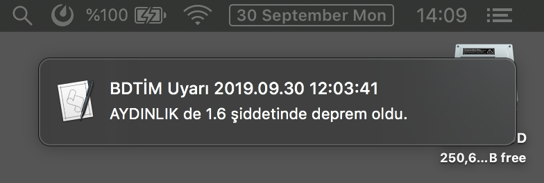

## Earthquake

Kandilli Rasathanesi'nin son depremler sayfasını cli dan belirtilen periodlarda gezip belirlenen şiddetten büyük olan depremleri bildirim olarak gösterir.

## Installation

```bash
git clone git@github.com:murat/earthquake.git && cd earthquake
go build .
```

## Usage

```bash
go run . -period 135 -min 1
# ve ya
./earthquake -period 60 -min 3.5
```

## Screenshots


